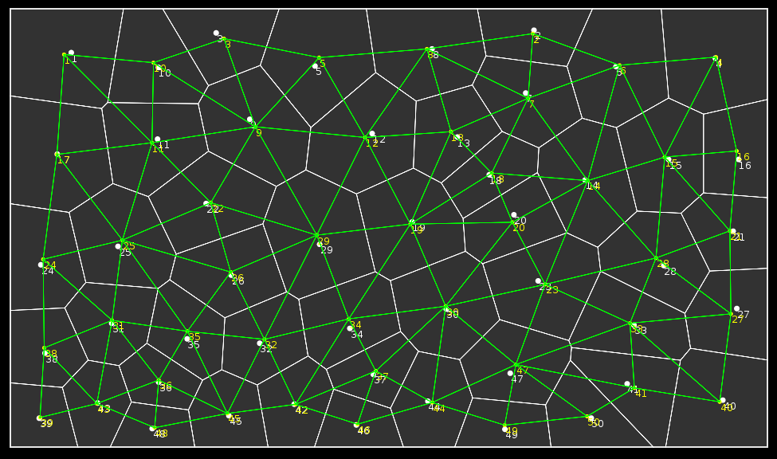

## Voronoi Polygon Generator written in Lua



License
---
MIT License

What this is
----
This is free to use Lua implementation of a Voronoi Generator. I wanted to experiment with using voronoi polygons to create a procedurally generated landscape and could not find a lua implementation to use that I liked. I programmed one from scratch which did not use any fast or popular algorithm (it use a geometric algorithm) which resulted in calculation times of up to 15 minutes for a 200 point diagram. This algorithm (Fortune's Algorithm) does that in a matter of seconds.

The intent of this project is to have a simple to use Voronoi generator which allows one to access the polygons and their relationships with other polygons.

How to Use
----
The lua code is currently scattered since it is under active development. There are many bugs and fine tuning that is required before a clean release is available. But to show how this works ....

For the current 'working' build
```lua
    require 'constants'
    require 'mathfuncs'
    require 'voronoi'
    require 'generator'
```
And to create a diagram, you need to call this anywhere you load resources.
```lua
    your_new_diagram = voronoi:create(pointcount,iterations,startx,starty,framesizex,framesizey)
```
And to access the pieces of the diagram you could do
```lua
    -- points used to generate the diagram
    for index,point in pairs(your_new_diagram.points) do
      point.x, point.y
    end
    
    -- polygons
    for index,polygon in pairs(your_new_diagram.polygons) do
      unpack(polygon) -- just a table of points, no structure
    end
    
    -- relationships (the green lines in the diagram above)
    for index,neighborindexes in pairs(your_new_diagram.polygonmap) do
      unpack(neighborindexes) -- just a table of indexes for neighboring polygons 
    end
```
All indexes for all elements are the same. So say you want to look polygon #1 (the top left corner). You can find its neighbors by doing
```lua
    local neighbors = your_new_diagram.polygonmap[1]
```
Which would give you a table like below
```lua
    neighbors == { 17, 11, 10 } 
```
Which you could then use those indexes to access whatever data you need from the diagram, get its centroid, or is neighbors.

Sources / Credits
----

Polygon detection, iteration, structuring by Domagoj Jursic (2013)
https://github.com/interstellarDAVE

Lua translation of Fortune's Algorithm from David Ng (2010)
https://love2d.org/forums/viewtopic.php?f=5&t=4212

Original algorithm from Steve J. Fortune (1987) 
A Sweepline Algorithm for Voronoi Diagrams, Algorithmica 2, 153-174, and its translation to C++ by Matt Brubeck, 
http://www.cs.hmc.edu/~mbrubeck/voronoi.html
