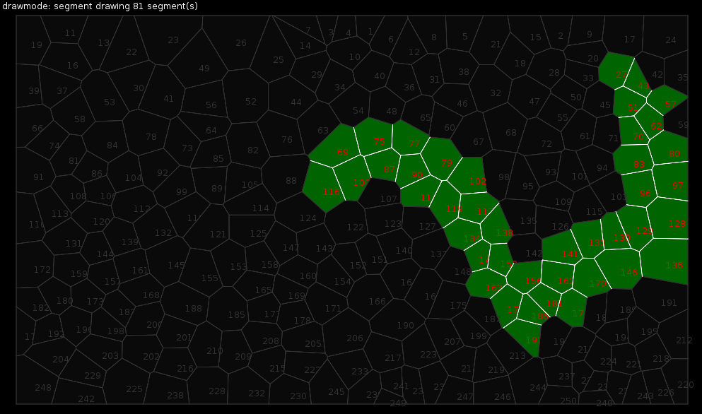

## voronoilib:getEdges(...)

```lua
    table lines = voronoilib:getEdges(mode,polygon_index_1, polygon_index_2, polygon_index_3, ..., polygon_index_n)

    lines = { edge1, edge2, edge3, ..., edge_n }
    edge1 = { x1, y1, x2, y1 }
```

getEdges(...) returns the edges of a polygon, or the shared edges if the input is more than one polygon. There are two different draw modes that can be used: 'segment' and 'vertex'.



'Segment' will return all the share edges between the input polygons.


'Vertex' will return all the shared edges where all the vertecies of the edge are shared with 3 polygons.

License
---
MIT License