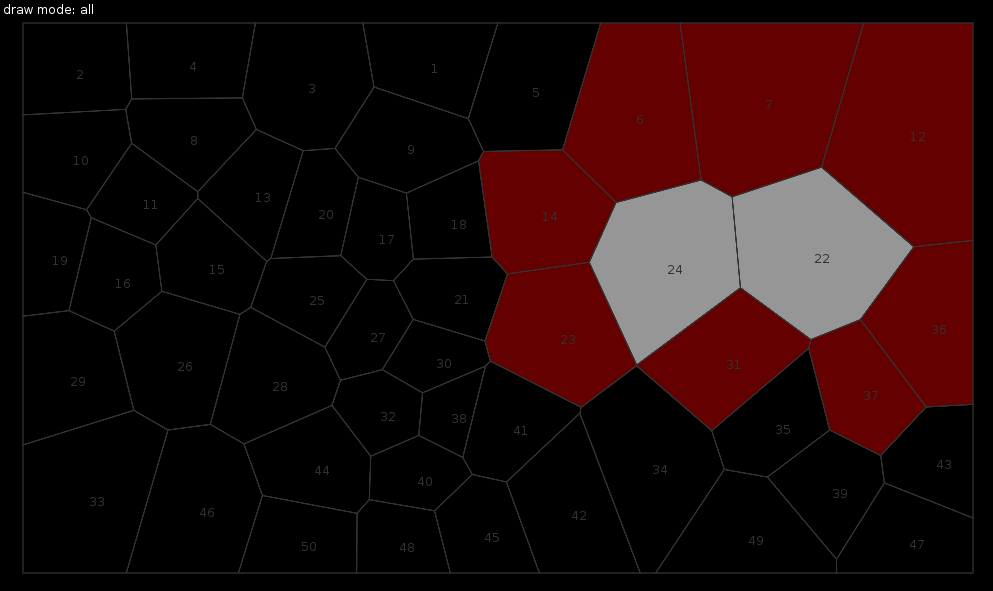
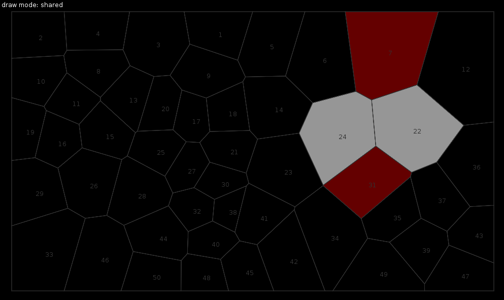

[Home](../../ "Home")

## voronoilib:getNeighbors(...)

```lua
   table neighborpolygons = voronoilib:getEdges(mode,polygon_index_1, polygon_index_2, ..., polygon_index_n)

   neighborpolygons = { neighbor_polygon_1, neighbor_polygon_2, .... neighbor_polygon_n
```

getNeighbors(...) returns a table of neighbors to the inputed polygon. If there are multiple inputs it will return all the shared neighbors.

There are two different modes that can be used, 'all' and 'shared'.



'All' returns all the polyon neighbors not included the input polygons themselves.



'Shared' returns only the polygons that all the inputed poylgons share.

License
---
MIT License
